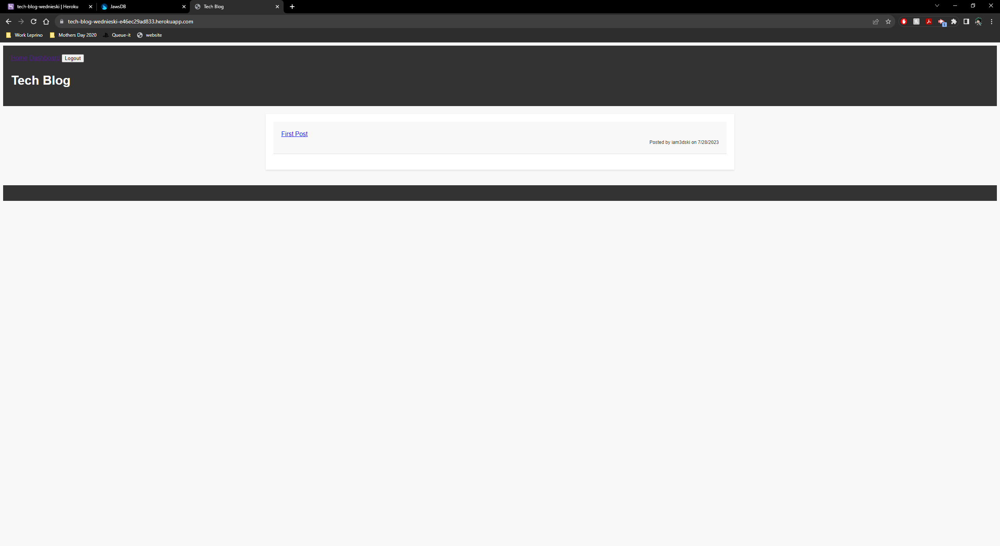
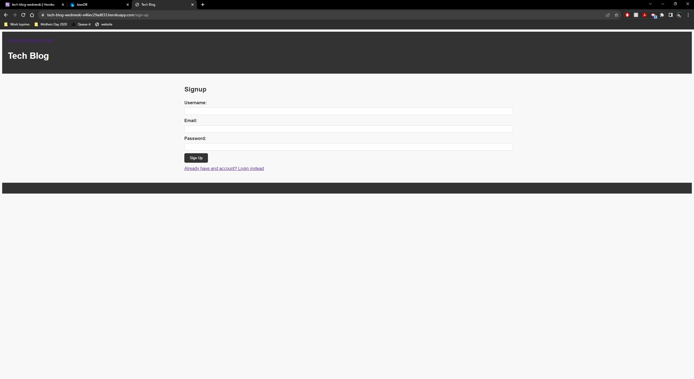
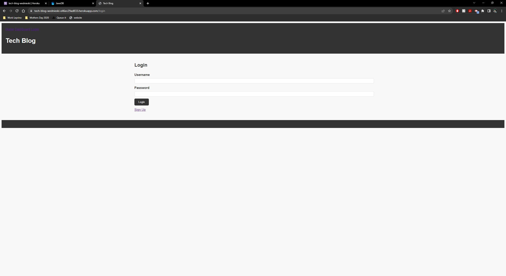
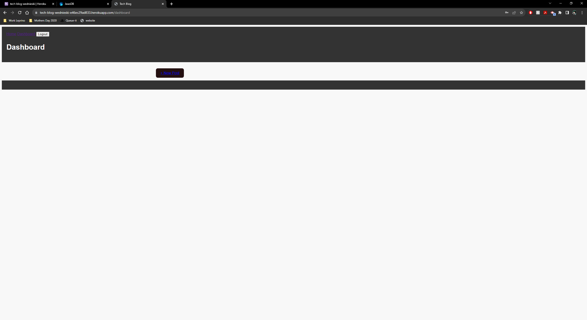
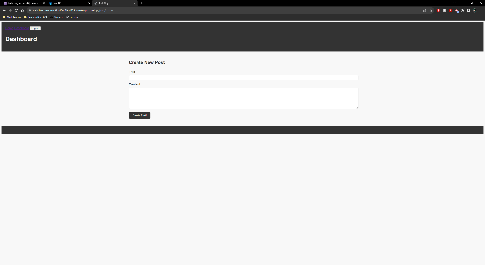

  # Tech Blog
  
  ## Description 
  A CMS-style blog site where users can create a new account, authenticate, view blog posts, create blog posts and comment on blog posts.
  
  ## Table of Contents
  * [Technology Stack](#technology-stack)
  * [User Story](#user-story)
  * [Acceptance Criteria](#acceptance-criteria)
  * [Installation](#installation)
  * [Screenshot](#screenshot)
  * [Deployed Page](#deployed-page)
  * [License](#license)
  * [Contributors](#contributors)

  ## Technology Stack


  ## User Story
  ```md
    AS A developer who writes about tech
    I WANT a CMS-style blog site
    SO THAT I can publish articles, blog posts, and my thoughts and opinions
  ```

  ## Acceptance Criteria
  ```md
    GIVEN a CMS-style blog site
    WHEN I visit the site for the first time
    THEN I am presented with the homepage, which includes  
    existing blog posts if any have been posted; navigation  
    links for the homepage and the dashboard; and the option  
    to log in
    WHEN I click on the homepage option
    THEN I am taken to the homepage
    WHEN I click on any other links in the navigation
    THEN I am prompted to either sign up or sign in
    WHEN I choose to sign up
    THEN I am prompted to create a username and password
    WHEN I click on the sign-up button
    THEN my user credentials are saved and I am logged into the site
    WHEN I revisit the site at a later time and choose to sign in
    THEN I am prompted to enter my username and password
    WHEN I am signed in to the site
    THEN I see navigation links for the homepage, the dashboard,  
    and the option to log out
    WHEN I click on the homepage option in the navigation
    THEN I am taken to the homepage and presented with existing  
    blog posts that include the post title and the date created
    WHEN I click on an existing blog post
    THEN I am presented with the post title, contents, post creator’s  
    username, and date created for that post and have the option to  
    leave a comment
    WHEN I enter a comment and click on the submit button while signed in
    THEN the comment is saved and the post is updated to display the comment,  
    the comment creator’s username, and the date created
    WHEN I click on the dashboard option in the navigation
    THEN I am taken to the dashboard and presented with any blog posts I have  
    already created and the option to add a new blog post
    WHEN I click on the button to add a new blog post
    THEN I am prompted to enter both a title and contents for my blog post
    WHEN I click on the button to create a new blog post
    THEN the title and contents of my post are saved and I am taken back to  
    an updated dashboard with my new blog post
    WHEN I click on one of my existing posts in the dashboard
    THEN I am able to delete or update my post and taken back to an updated  
    dashboard
    WHEN I click on the logout option in the navigation
    THEN I am signed out of the site
    WHEN I am idle on the site for more than a set time
    THEN I am able to view posts and comments but I am prompted to log in  
    again before I can add, update, or delete posts
  ```
  
  ## Installation 
  
  * Ensure you are running Node.js v16.
  * Clone the repository.
```
git@github.com:iam3dski/tech-blog-restart.git
```

  * Install the dependencies.
    * Install [MySQL](https://dev.mysql.com/doc/mysql-installation-excerpt/5.7/en/)
  ``` node
     cd tech-blog-restart
     npm i
  ```

  * Start the MySQL server in the terminal
  ``` bash
    mysql -u root -p 
  ```

  * Enter the password
  ``` bash
    password_goes_here
  ```

  * Once MySQL server has started, create the database
  ``` bash
    SOURCE db/schema.sql 
  ```

  * Exit the MySQL server
  ``` bash
    exit OR quit
  ```

   * Create an .env file in the root directory and set your local MySQL server username and password
  > Don't worry, it will only be saved to your local machine. The .env file is in .gitignore
  ``` bash
    DB_NAME='your_database_name_here'
    DB_USER='your_username_here'
    DB_PW='your_password_here'
  ```
  * Start the application
   ``` bash
    npm start
  ```
  > Application available at localhost:3001

  ## Screenshot
  
  
  
  
  
  
  ## Deployed page

  [View Published Page](https://tech-blog-wednieski-e46ec29ad833.herokuapp.com/)
  
  ## License 
  [](https://lbesson.mit-license.org/)
  
  ## Contributors 
   [Dylan Wednieski](https://github.com/iam3dski)